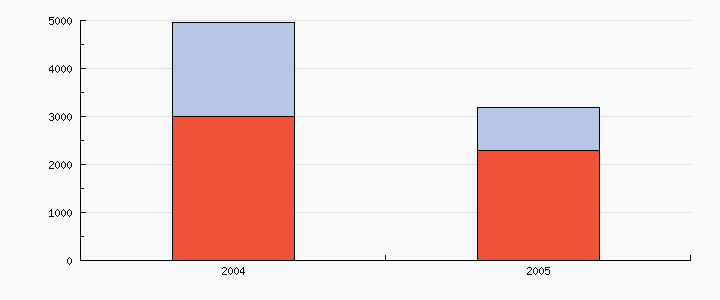
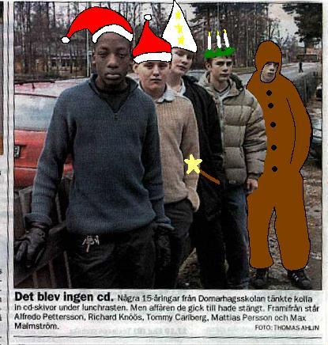

# History

When I heard that there was going to be a documentary about this article I
thought I would see if I could dig up som old versions of this site. Since it's
been around since 2004 many years has passed but not that much has changed. The
domain name [det-blev-ingen-cd-com](https://det-blev-inge-cd.com) was registered
2004-11-22 and [the first
version](https://web.archive.org/web/20041210103303/http://det-blev-ingen-cd.com/)
indexed by [WaybackMachine](https://web.archive.org) dates back to 2004-12-10
and there are a total of > 120 indexed versions as of this writing.

## Statistics

Sadly all statistics from the page is lost in cyberspace and I only added Google
Analytics back in June 2019. The first years the site relied on the statistics
gathered via Gate9, the domain registrar and hosting provider I had at the
start. The only traces I found is a screenshot of number of visitors and [which
country](gate9_statistics_countries.png) they originated from.

Since the domain was registered in November 2004 this means the site had ~5000
hits the first month and I would guess the screenshot is from early 2005.

## Languages

So the page looks more or less the same but it has had a few transformations via
multiple programming languages.

### ASP

The very first version was written in [Classic
ASP](https://en.wikipedia.org/wiki/Active_Server_Pages) and was my way to
support multiple languages. Since day one the site has been available in both
Swedish and English.

Sadly I can't find the first version but I found
[asp_admin_page.asp](asp_admin_page.asp) which seems to be a page with links to
the hosting provider control panel (for statistics) and also the place for me to
very safely store my password to said account (still in the source code). The
password to the actual admin page is also just plain text in the file. I guess
this was before password managers enterd my life. 🔐

### PHP

When I dropped ASP and started to learn PHP I re-wrote the page. The heavy logic
for the languages was more or less the same but at this point there were more
languages. [first_php.php](first_php.php) still have the commented out
duplication of the `$_GET` if statements but the final PHP version seems to be a
bit more DRY.

### JavaScript

So at some point I guess I realised that it's not super cool to reload the whole
page each time the language is being changed. Because of that the page was
re-written and this time the language was changed with JavaScript.
[first_javascript.js](first_javascript.js) was named `query.js` when I found it,
I guess since it uses jQuery for the advanced element accessing!

### Elm

The current version is written in Elm, mainly because I wanted to try out the
syntax.

## Banners and customization

Even though the page never really changed much there are a few occations where
the site has had banners.

### Red Cross

The very first one was actually just after I bought
the domain and after the tsunami in Thailand around christmas 2004. The banner I
added was the one from the [Red Cross](https://www.rodakorset.se/) encouraging
people to donate.

### First time dad

Sadly I can't remember which one of the poor boys in the image it was but I
remember reading (probably at Flashback) about one of the guys in the picture
having his first baby. Around this time the site had a big text at the top
congratulating him on his child.

### Christmas

One year we changed the splash image to a custom one during the hollidays. The
image was created by yours truly with
[Paint](https://en.wikipedia.org/wiki/Microsoft_Paint).

### The documentary

So I have defenitely nothing to do with this but somehow the comedian Jonas
Strandberg have had a similar relation to this article in the same way that made
me pay for the domain and hosting for this site for 15 years at this point. When
I heard that there was going to be a documentary I did the obvious thing and
contributed to the project and bought tickets as soon as the relea

* [Trailer 1](https://youtu.be/PHMH3GBJ3NE)
* [Trailer 2](https://youtu.be/u8cEz-UYpik)
* [Facebook group](https://www.facebook.com/detblevingencd/)
* [Moviezine](https://www.moviezine.se/nyheter/biopremiar-for-dokumentaren-det-blev-ingen-cd)
* [Café](https://www.cafe.se/det-blev-ingen-cd-biopremiar-datum/)
* [Gaffa](https://gaffa.se/nyhet/136759/den-ikoniska-cd-notisen-blir-dokumentaer-se-senaste-trailern/)
* [Nöjesguiden](https://ng.se/artiklar/komiker-gor-dokumentar-om-det-blev-ingen-cd-killarna)
* [TWNews](https://twnews.se/se-news/det-blev-ingen-cd-men-det-blev-en-biofilm-da-har-dokumentarfilmen-premiar-pa-bioduken)
